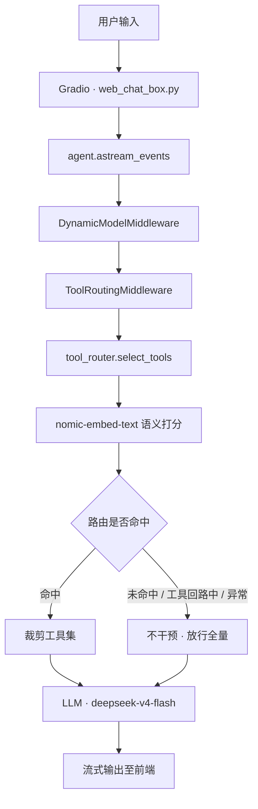

# Agent Tool Routing & RAG

一个从零搭建的 LLM Agent 系统，集成**工具调用、联网搜索、RAG 知识库检索、多轮记忆**，并针对「工具数量增长后模型选择准确率下降」这一核心问题，设计并实现了一套**基于语义距离的工具路由层**。

> 技术栈：Python 3.12 · LangChain 1.3 · LangGraph · ChromaDB · Gradio · Ollama

---

## 目录

- [1. 项目背景](#1-项目背景)
- [2. 功能特性](#2-功能特性)
- [3. 系统架构](#3-系统架构)
- [4. 核心设计：工具语义路由](#4-核心设计工具语义路由)
- [5. 网络搜索路由](#5-网络搜索路由)
- [6. RAG 检索链路](#6-rag-检索链路)
- [7. 项目结构](#7-项目结构)
- [8. 快速开始](#8-快速开始)
- [9. 文件接入模块](#9-文件接入模块)
- [10. 已知限制](#10-已知限制)
- [11. 路线图](#11-路线图)
- [12. 许可证](#12-许可证)

---

## 1. 项目背景

大语言模型通过 function calling 使用工具，但当工具数量变多、描述彼此相似时，**模型选错工具的概率显著上升**——这是 Agent 落地过程中普遍存在的瓶颈。

传统的应对方式有二：优化提示词，或人工编写 `if/elif` 分发。前者不稳定，后者可扩展性差。

本项目的思路是**让 query 自己做路由**：对用户提问做一次 embedding，计算其与各工具语义描述的相似度，按分数自动筛选出本次应暴露的工具集合。新增工具时只需补充一条路由描述，调用方零改动。

---

## 2. 功能特性

- [x] **工具语义路由** —— 基于 embedding 相似度自动筛选工具，替代手工 `if/elif`
- [x] **负例抑制机制** —— 打分从单一「正分」升级为「正分 − 负例抑制」，降低误绑率
- [x] **只裁剪、不否决** —— 中间件仅缩小候选集，工具调用与否始终由模型自主决定
- [x] **网络搜索多供应商路由** —— 博查 / Tavily / DuckDuckGo，按语种与可用性自动降级
- [x] **RAG + Cross-Encoder 重排序** —— top-50 粗排 → cross-encoder 精排 → top-3
- [x] **增量索引** —— 基于 `mtime + size` 指纹，仅处理新增/变更文件
- [x] **多轮短期记忆** —— 基于 LangGraph checkpointer 的会话级记忆
- [x] **流式输入输出** —— Gradio 网页端实时逐 token 渲染
- [x] **动态模型选择中间件** —— 运行时按会话长度切换底层模型
- [x] **人格注入** —— `character/` 目录热加载，人格文件改动即时生效
- [ ] 跨会话长期记忆（主动写入本地文档）—— *规划中*
- [ ] Agent 文件读写能力 —— *进行中*，见[第 9 节](#9-文件接入模块)

---

## 3. 系统架构

### 3.1 请求流程



### 3.2 装配入口

`wonder_agent.py` 是全项目唯一的 `create_agent` 调用点：

```python
agent = create_agent(
    model=basic_model,
    tools=tools,
    system_prompt=build_system_prompt(),
    middleware=[DynamicModelMiddleware(), ToolRoutingMiddleware()],
    checkpointer=InMemorySaver(),
)
```

> **注意**：中间件的注册顺序即执行顺序——`DynamicModelMiddleware` 在前、`ToolRoutingMiddleware` 在后。调整顺序会改变两者的可见状态。

---

## 4. 核心设计：工具语义路由

这是本项目投入最多的部分。

### 4.1 问题

工具增多后，模型容易「乱选」。例如「看一下时间」这类短句，可能同时命中 `web_search`、`rag`、`system_timezone` 三者的描述，导致一次简单提问触发多个无关调用。

### 4.2 方案：两层打分 + 负例抑制

不是把 query 分配到不同的 Agent 管线，而是**对 query 做一次 embedding，依据语义距离决定本次暴露哪些工具**。

打分逻辑的演进：

```text
v1: score     = 0.7 × example_sim + 0.3 × desc_sim      # 仅正例，容易误绑
v2: net_score = pos_score − neg_alpha × neg_sim         # 引入负例抑制
```

| 项 | 含义 |
|---|---|
| `pos_score` | 正例相似度（权重 0.7）+ 路由描述相似度（权重 0.3） |
| `neg_sim` | 与 `negative_examples` 的最大余弦相似度，越像负例越高 |
| `net_score` | 净分，被负例拉低 |

**负例必须写「难负例」**——即「看起来很像本路由、实则属于其他路由」的句子。抽象表述（如"不要在不需要时调用工具"）等同于噪音，只会增加提示词长度而不产生区分度。

### 4.3 决策链

`select_tools()` 的决策过程分三步：

1. **过闸** —— `net_score >= threshold` 且 `neg_sim < neg_threshold`（后者可关闭）
2. **赢家通吃** —— 只保留与最高分相差在 `tie_margin` 内的路由，取前 `top_n` 条
3. **组装** —— 合并命中路由的工具，去重并保持优先级顺序

当前参数（`self_packages/tool_router.py`）：

| 参数 | 取值 | 说明 |
|---|---|---|
| `threshold` | `0.55` | 净分入选阈值，唯一的核心旋钮 |
| `neg_alpha` | `0.3` | 负例抑制强度 |
| `neg_threshold` | `None` | 硬排除红线，已关闭 |
| `top_n` | `1` | 最终保留的路由数 |
| `tie_margin` | `0.02` | 视为并列的分差 |

阈值校准由 `calibrate.py` 完成，内嵌测试语料，支持对 `(neg_alpha, neg_threshold, 聚合方式)` 做网格扫描。

### 4.4 只裁剪、不否决

中间件持有两种潜在权力，二者的**误判代价并不对称**：

| 权力 | 手段 | 判错后果 | 可恢复性 |
|---|---|---|---|
| 裁剪权（软） | 缩小 `request.tools` | 多给/少给一个工具，`auto` 下模型可以选择不用 | 可恢复 |
| 否决权（硬） | `tool_choice="none"` | 该轮模型彻底失去信息通道，只能硬答或编造 | **不可恢复** |

「没有任何路由过闸」是一个**残差判定**——它同时覆盖「确实不需要工具」（闲聊）与「路由漏检」（如"现在几点了"这类必然需要工具的提问），二者无法区分，正确性不可验证。

**残差判定不应持有不可恢复的权力。** 因此当前设计整体移除了否决权：中间件只做裁剪，`tool_choice` 始终交回模型（默认 `auto`）；路由未命中时**不干预**，工具声明照旧给全，由掌握完整上下文的模型自行判断。

### 4.5 关键不变式：永不产生空工具集

> **本中间件永远不会把 `request.tools` 覆盖为空列表。**

一旦 `tools` 为空，`langchain/agents/factory.py` 中的 `if final_tools:` 判断会让 `bind_tools` 整段跳过，连 `tool_choice` 字段都不会进入请求体。模型因此失去工具通道，而系统提示词仍在要求它调用工具——**它只能把调用写成正文文本**，即 DSML 退化：

```text
＜｜｜DSML｜｜ calls＞
＜｜｜DSML｜｜ invoke name="web_search"＞
＜｜｜DSML｜｜ parameter name="query" string="true"＞iPhone 18 发布 价格＜｜｜/parameter＞
＜｜｜DSML｜｜/invoke＞
＜｜｜DSML｜｜/calls＞
```

**根因**：模型认为「有工具可调」，而输出通道不可用，两个条件同时成立。

**错误的应对**：再加一层兜底，保证工具集非空。这会让几乎任何 query 都被强制绑定一个工具，「哈哈哈笑死」也会去调时间工具。

**当前的应对**：残差时**不干预**（决策返回 `None`，原样放行），而不是「关闸」。没有候选的正确表达是不干预，而不是空集。

### 4.6 决策汇总

| 情形 | 中间件行为 | `tool_choice` |
|---|---|---|
| 路由命中 | 裁剪至命中的工具 | 默认（`auto`） |
| 路由未命中（残差） | 不干预，放行全量 | 默认（`auto`） |
| 正处在工具回路中 | 不干预 | 默认（`auto`） |
| 取不到用户文本 / 路由异常 | 不干预 | 默认（`auto`） |
| 决策名与 `request.tools` 对不上 | 不干预 + `warning`（数据 bug，不应封死通道） | 默认（`auto`） |

### 4.7 工具回路粘性防护

`_in_tool_loop()` 用于防止**多轮粘性**：判据是「**最后一条用户消息之后**是否已出现 `ai.tool_calls` 或 `ToolMessage`」。

之所以限定在「最后一条用户消息之后」而非扫描整个历史：Agent 的工具回路本就是在最后一条 user 消息之后不断追加 `ai(tool_calls) → tool(result) → ai(...)`，直到给出最终答复。用户一发新消息，回路即结束，此时应恢复正常裁剪。若扫描全历史，则长会话中只要调过一次工具，之后每一轮都会永久跳过裁剪——中间件等于失效。

### 4.8 提示词的职责边界

系统提示词**不再声明任何工具清单**，所有工具信息集中到各自的 `description` 中，由 function calling 的 schema 传递给模型。

这样做的收益：工具描述的权威来源唯一化，后续优化模型的工具调用意愿，只需修改对应工具对象的 `description`，不必同步维护提示词。

---

## 5. 网络搜索路由

不引入额外的 embedding 模型，依靠**轻量启发式 + 配置态**决定，避免每次搜索多消耗一次 LLM 调用。

**配置层（硬路由）** —— 依据哪些 Key 存在决定候选集：

- `BOCHA_API_KEY` 存在 → 博查可用
- `TAVILY_API_KEY` 存在 → Tavily 可用
- `DEV_DDG_FALLBACK=1` → DuckDuckGo 进入候选

**查询层（软路由）** —— 对 query 做轻量判断：

- 含中日韩字符 → 优先博查（中文索引更强）
- 纯 ASCII 且形似英文短语/技术名 → 博查失败后转 Tavily
- 调用异常（429 / 超时 / 空结果）→ 自动跳转下一个可用供应商

**容错链**：供应商按顺序尝试，全部失败时返回固定错误串，**不让 LangGraph 的 ToolNode 抛异常炸图**。

> **说明**：博查的本地化搜索基于请求 IP，在服务端完成定位。AI 本身看不到该 IP，也拿不到定位结果。

---

## 6. RAG 检索链路

**检索流程**：

```text
query → Chroma 粗排 top-50 → cross-encoder 精排 → 返回 top-3 → 喂入 LLM
```

| 环节 | 选型 | 说明 |
|---|---|---|
| 向量库 | ChromaDB | 本地持久化，`chroma_rag/` |
| Embedding | `nomic-embed-text` | 768 维，经 Ollama 本地推理 |
| 粗排 | 余弦相似度 top-50 | 保证召回 |
| 精排 | `BAAI/bge-reranker-v2-m3` | cross-encoder，压缩至 top-3 |

**为何需要重排序**：向量检索将文本压缩为单一向量，压缩过程会丢弃词序、重点与细粒度匹配信号。Cross-Encoder 把 `(query, document)` 作为一对直接过一遍 transformer 输出相关性分数，精度显著更高——代价是慢，因此只作用于第一轮已召回的候选集。

**切片策略**：`chunk_size=400`、`chunk_overlap=50`，分隔符按 `\n\n → \n → 。 → ！ → ？ → 空格` 逐级回退。

> **警告**：修改 `chunk_size` 或 `chunk_overlap` 后必须删除旧库重建。切片边界不一致会导致同一文档的向量分布漂移，检索精度明显下降。
>
> ```bash
> rm -r chroma_rag
> ```

**关于 Embedding 模型的选择**：通用 embedding（如 bge 系列）经对比学习专门训练，目标是让「相似句靠近、无关句远离」，因而擅长检索与语义匹配；LLM 的 hidden state 以预测下一 token 为目标，检索能力弱、生成能力强。二者不可混用——查询与文档必须使用**同一个** embedding 模型，否则向量空间不一致，距离失去意义。

---

## 7. 项目结构

```text
RAG/
├── wonder_agent.py                  ★ Agent 装配入口（唯一 create_agent 调用点）
├── web_chat_box.py                  ★ Gradio 网页入口（→ :7860）
├── pyproject.toml / uv.lock           uv 依赖管理，Python 3.12
│
├── self_packages/                   ★ 核心功能包
│   ├── tools.py                       工具池汇总（唯一注册点）
│   ├── dynamic_select.py              basic/advanced 模型 + DynamicModelMiddleware
│   ├── tool_routing_middleware.py     ToolRoutingMiddleware（按语义裁剪工具）
│   ├── tool_router.py                 SemanticToolRouter（embedding 打分路由引擎）
│   ├── routes_archive.py              路由表 ROUTES（语料 / 负例 / 互斥 / 工具映射）
│   ├── prompts.py                     人格加载 + system prompt 拼装
│   ├── web_search.py                  搜索聚合（按 CJK 分流）
│   ├── web_search_provider.py         三家搜索的后端实现
│   ├── update_index.py                增量建索引（mtime+size 指纹）
│   ├── build_index.py                 早期全量建索引脚本（已弃用）
│   ├── calibrate.py                   路由调参 / 评测脚本
│   ├── permission.py                  user_id → basic/pro/quant 权限表
│   ├── chat_box.py                    CLI 对话入口（保留）
│   ├── response_format.py             结构化输出 schema（当前未启用）
│   └── .env                           API Keys（已 gitignore）
│
├── file_ingest/                     ★ 文件接入模块（详见第 9 节）
│   └── file_ingest/
│       ├── loader.py                  多格式解析：pdf / pptx / docx / 代码
│       ├── store.py                   FileStore：Chroma 封装，按 file_id 隔离
│       ├── router.py                  has_file_intent() 文件意图硬路由
│       ├── prompt.py                  文件清单注入 system prompt
│       ├── tools.py                   ingest_file / query_file
│       └── tests/                     测试套件
│
├── character/                       人格源文件（IDENTITY / SOUL / USER …）
├── chroma_rag/                      向量库数据（chroma.sqlite3 + file_state.json）
├── docs/                            RAG 语料目录
└── pictures/                        头像等静态资源
```

---

## 8. 快速开始

### 8.1 环境准备

依赖由 `uv` 管理：

```bash
uv sync
```

本地推理需要 Ollama，并预先拉取所需模型：

```bash
ollama pull nomic-embed-text
```

Cross-Encoder 重排序模型 `BAAI/bge-reranker-v2-m3` 将在首次运行时自动下载（约 2 GB）。下载完成后可设置 `HF_HUB_OFFLINE=1` 走离线模式以提升启动速度。

### 8.2 配置环境变量

在 `self_packages/.env` 中填入所需 Key（**请勿硬编码进代码**）：

```env
DEEPSEEK_API_KEY=xxx     # 模型 API；可在 dynamic_select.py 中替换为其他模型
BOCHA_API_KEY=xxx        # 博查（中文搜索）
TAVILY_API_KEY=xxx       # Tavily（英文搜索）
HF_TOKEN=xxx             # HuggingFace
HF_HUB_OFFLINE=1         # 模型下载完成后建议开启
DEV_DDG_FALLBACK=1       # 开发环境启用 DuckDuckGo 兜底
```

### 8.3 构建知识库索引

将待检索的 `md` / `txt` / `pdf` 文件放入 `docs/`，然后执行：

```bash
python self_packages/update_index.py
```

脚本会扫描 `docs/` 全部文件，比对 `file_state.json` 中的指纹，**仅处理新增文件与 `mtime/size` 发生变化的文件**，切片后追加进已有 Chroma 库。

### 8.4 启动

```bash
uv run python web_chat_box.py
```

浏览器访问 `http://127.0.0.1:7860`（局域网内可通过本机 IP 访问，服务监听 `0.0.0.0`）。

---

## 9. 文件接入模块

`file_ingest/` 用于让 Agent 具备文件读取与检索能力。核心设计取向是：**文件不是输入数据，而是 Agent 可管理的资源**。

### 9.1 设计要点

- **`file_id` + Tool 方案**，而非前置管线。文件以 `file_id` 的形式进入对话历史，Agent 可在多轮对话中反复引用；相比「收到文件就塞进 prompt」，避免了内容滚出上下文窗口后彻底丢失的问题。
- **按体积分流**：≤ 30K tokens 的小文件全文进内存缓存（`inline`）；超过则切块写入 Chroma（`indexed`），通过 `where={"file_id": ...}` 保证文件间互不污染。
- **格式化切块**：PDF 按页、PPTX 按幻灯片（含备注）、DOCX 按标题层级、代码按函数/类符号切块（metadata 携带 `name` + `lineno`，用于精确定位而非概括）。

### 9.2 数据流

```text
用户上传文件
  → ingest_file(path, persist)
      → Loader.load() 解析为 DocChunk 列表
      → token 估算分流：inline 缓存 / indexed 入库
      → 返回 {file_id, mode, summary, ...}
  → file_id 写入对话历史

用户提问
  → Agent 调用 query_file(file_id, question)
      → inline   ：直接返回缓存全文
      → indexed  ：embed(question) → Chroma where 过滤 → top-5 片段拼接
```

### 9.3 依赖说明

各格式解析器为**可选依赖**，未安装时对应格式不可用（模块本身仍可导入，Loader 采用惰性导入）：

```bash
uv add pdfplumber python-pptx python-docx
```

代码 AST 切块需要 tree-sitter 及对应语言 grammar；不可用时自动降级为正则切块。

---

## 10. 已知限制

| 类别 | 问题 | 现状 |
|---|---|---|
| 路由 | 中文短句的 embedding 区分度不足，是残留误路由的根因 | 待迁移至 `bge-m3` |
| 路由 | 中英混合 query 召回不稳 | 同上，`bge-m3` 原生支持中英混合 |
| 路由 | 路由表精度依赖语料覆盖度 | 需持续迭代 `routes_archive.py` |
| 检索 | 切片策略对碎片化文档较敏感，结果"良好但脆弱" | 考虑 Markdown 结构化切分 |
| 搜索 | 搜索结果未做向量化二次筛选 | 当前直接使用供应商返回的摘要 |
| 记忆 | 仅会话级短期记忆，进程重启即丢失 | 长期记忆在规划中 |
| 文件 | `file_ingest/` 尚未接入主 Agent 工具池 | 集成中 |
| 工程 | 向量库路径使用相对路径，依赖当前工作目录 | 建议改为基于 `__file__` 解析 |

**历史问题记录**：

- **DSML 退化** —— 详见 [4.5 节](#45-关键不变式永不产生空工具集)。
- **「选错但答对」** —— 路由选错工具，但容错链兜底拿到了正确结果。此类问题比直接报错更隐蔽，因为它掩盖了路由缺陷，需通过日志中的 `[router] selected=` 主动排查。
- **上下文记忆失效** —— 重新引入 `checkpointer=InMemorySaver()` 后恢复；同时移除了易被误认为用户信息的 `get_user_location` 工具。
- **切片不一致** —— 修改切片参数后未重建索引导致检索精度下降，需删库重建。

---

## 11. 路线图

**近期**

- [ ] 迁移 embedding 至 `bge-m3`，根治中文短句与中英混合 query 的路由精度
- [ ] 持续优化 `routes_archive.py` 的语料覆盖与难负例质量
- [ ] 完成 `file_ingest/` 与主 Agent 工具池、语义路由的集成

**中期**

- [ ] 跨会话长期记忆：按日期归档，主动写入本地文档，不依赖服务进程常驻
- [ ] Agent 文件写入能力
- [ ] FastAPI 异步服务化，支持文件上传与多轮对话

**长期**

- [ ] 动态系统提示（依据用户输入选择提示词）
- [ ] 多步骤协作编排（AgentExecutor / LangGraph）
- [ ] Agent 主动提问能力
- [ ] 主动输出算法：在特定时段或情感需求期，基于近期记忆主动发起对话

---

## 12. 许可证

本项目基于 [MIT License](LICENSE) 开源。
